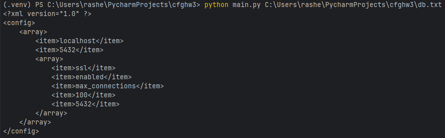
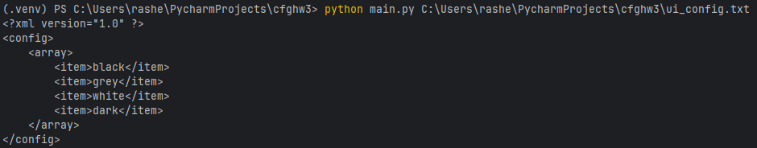

Задание №3
Разработать инструмент командной строки для учебного конфигурационного
языка, синтаксис которого приведен далее. Этот инструмент преобразует текст из
входного формата в выходной. Синтаксические ошибки выявляются с выдачей
сообщений.
Входной текст на учебном конфигурационном языке принимается из
файла, путь к которому задан ключом командной строки. Выходной текст на
языке xml попадает в стандартный вывод.
Однострочные комментарии:
:: Это однострочный комментарий
Многострочные комментарии:
--[[
Это многострочный
комментарий
]]
Массивы:
#( значение значение значение ... )
Имена:
[_a-zA-Z][_a-zA-Z0-9]*
Значения:
• Числа.
• Строки.
• Массивы.
Строки:
116
"Это строка"
Объявление константы на этапе трансляции:
(def имя значение);
Вычисление константы на этапе трансляции:
?{имя}
Результатом вычисления константного выражения является значение.
Все конструкции учебного конфигурационного языка (с учетом их
возможной вложенности) должны быть покрыты тестами. Необходимо показать 3
примера описания конфигураций из разных предметных областей.

Описание функций:
parse_config()предназначена для того, чтобы преобразовать текст, 
написанный на пользовательском конфигурационном языке, в структуру данных XML.

parse_array - предназначена для обработки вложенных конструкций

Для запуска программы необходимо вписать в командную строку
В общем случае:

python <файл программы> <путь к файлу с исходным текстом на конф. языке>

В моем случае:

python main.py C:\Users\rashe\PycharmProjects\cfghw3\db.txt

Примеры выполнения программы на текстовых примеров из разных предметных областей

db.txt - Конфигурация для базы данных

(def db_host "localhost");

(def db_port 5432);

(def db_params #(ssl enabled max_connections 100));

?{db_host}

?{db_port}

?{db_params}

Результат:

ui_config - Конфигурация для UI
(def theme "dark");

(def font_size 12);

--[[ Комментарий:

Этот массив содержит цвета для темы ]]

#(  "black" "grey" "white"  )

Результат:

interface.txt - Конфигурация для интерфейса приложения

:: Однострочный комментарий

(def name "Configuration");

(def settings #( "строка1" 2 #(3 "вложенный массив")));

?{name}

?{settings}

--[[

Это многострочный

комментарий

]]

(def colors #( "красный" "зеленый" "синий" ));

?{colors}

Результат:

Тестирование:
Тестирование было проведено с использованием фреймворка unittest в Python. 
Для тестирования использовалась функция parse_config из модуля main. В тестах проверялись следующие случаи:
Корректная конфигурация (test_parse_valid_config): 
Проверяется, что парсер правильно обрабатывает конфигурацию с определенными константами и массивами, а также создает соответствующие XML элементы (константы, массивы и вычисления).
Некорректная конфигурация (test_parse_invalid_config): 
Проверяется, что при попытке обработки несуществующей переменной (например, ?{UNDEFINED_CONST}) возникает ошибка синтаксиса (SyntaxError).
Пустая конфигурация (test_parse_empty_config): 
Проверяется, что парсер корректно обрабатывает пустую конфигурацию, не создавая никаких элементов.
Числа и строки (test_parse_number, test_parse_string): 
Проверяется, что числа и строки корректно распознаются и обрабатываются, создавая соответствующие XML элементы.
Массивы и вложенные массивы (test_parse_array, test_parse_nested_array): 
Проверяется, что массивы (в том числе вложенные) правильно преобразуются в XML элементы с нужными подэлементами.

Результаты тестирования:

Ссылка на репозиторий:
https://github.com/exerovv/config3
